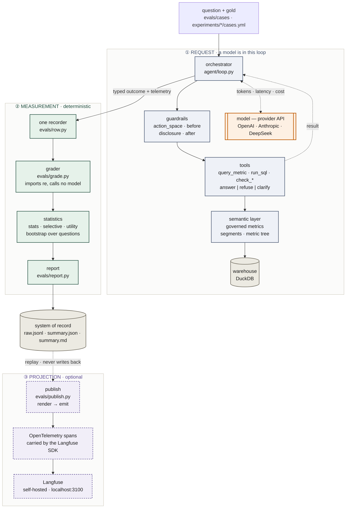

# System — the three planes

`ANATOMY.md` describes the agent as a reference agent: the orchestrator, the tools, the
guardrails. This document is the layer above it — the whole system, including the part that
measures the agent and the part that makes a finished run readable.

The architecture has one governing idea. **Three planes, and only the first one contains a
model.** Everything downstream of the answer is deterministic, and everything downstream of the
stored row is a one-way projection. That is what makes a published number reproducible by someone
who has neither an API key nor a dashboard.

| in the diagram | means |
|---|---|
| orange, double-bordered | the only component that is not deterministic |
| green | deterministic: same input, same output, no key required |
| grey cylinder | durable storage |
| purple, dashed | optional — absent by default, and nothing depends on it |
| dotted arrow | a read, or a call that leaves the process |

## The three planes

### ① Request path — the agent

Covered in full by `ANATOMY.md`. One question in, one typed outcome out
(`answer` / `refuse` / `clarify`), with guardrails mounted at four positions: which tools exist at
all, whether a call may run, what a result really covers, and whether an answer may be served.
The model is reached by an outbound API call and is the swappable part.

This is the only plane that costs money and the only one whose output varies between identical
runs.

### ② Measurement path — the harness

Everything here is deterministic. `grade.py` imports `re` and two pure helpers, and calls no model
at any rung: verdicts come from a gold figure, the terminal action the question requires, or a
typed slot. Where a verdict comes from matching words in free text the row records
`graded_by: prose` and the report prints the share, because that path cannot be audited.

Three properties hold this plane together:

| property | mechanism |
|---|---|
| One definition of a measurement | `evals/row.py` is the single recorder. Runners call `measured_row` and write no fields of their own; `test_semantic.py` holds it to the `Answer` field list. |
| The thermometer does not vary with the treatment | The question suite carries a content hash (`gold.stamp_suite`), and the model-visible surface is pinned across 24 rung/guardrail cells by `test_surface.py`. |
| Infrastructure is never behaviour | A crashed row is `bucket: error`, excluded from every rate and listed separately. |

### ③ Projection — Langfuse

`bench publish` reads the stored rows and emits them a second time in a different shape. It is a
projection, not a second write path: `raw.jsonl` remains the system of record, nothing in
`engine/` imports `publish.py`, and the whole test suite runs with the dependency absent. CI syncs
without the `observability` group, so that last property is proved on every push rather than
asserted.

What the projection maps:

| harness | Langfuse |
|---|---|
| question suite | dataset, named by the suite hash |
| question | dataset item |
| cell — one model × one guardrail config | dataset run |
| row — one question asked once | trace, with a deterministic id |
| model call | generation span, with tokens and **our** price |
| tool call | tool span |
| guardrail act | guardrail span |
| per-row measurement | score |
| set-level metric | score prefixed `run/` |

## Where OpenTelemetry actually is

The spans published to Langfuse **are** OpenTelemetry spans. The Langfuse Python SDK (4.15.3) is
an OTel tracer provider: `LangfuseSpan` wraps `opentelemetry.trace.span.Span`, and the SDK
configures its own `TracerProvider` and OTLP exporter pointed at the Langfuse collector.

**This repository configures none of that, and imports OpenTelemetry nowhere.** OTel is the wire
format underneath the publish step, not something built here. Stating it precisely matters in both
directions:

- It is not a claim that the harness is instrumented with OTel. There is no tracer in the agent,
  no exporter in the harness, and no OTLP endpoint in any configuration file.
- It does mean a second destination is reachable without changing what is recorded, because the
  data already leaves as OTLP. That would be new configuration and a second span processor — not
  a one-line change, and not done.

The reason to know this is the exit: nothing in the stored rows is shaped by Langfuse, so
replacing the backend means writing a second adapter behind `render`, which is pure and returns a
vendor-neutral dict.

## Two boundaries worth defending

**The backend does not own the price.** `ModelSpec.cost` discounts cached input and flags an
unconfirmed price. A backend applying its own model table would disagree with every published
figure, so each generation span carries the cost `row.py` computed. The spans sum to the row
exactly.

**The backend does not own the metrics.** Coverage, silent error and balanced accuracy are
set-level with pile-aware denominators — balanced accuracy averages the piles that *have*
questions. No backend that aggregates scores by mean can express that, so those numbers are
computed in the harness and pushed as facts under the `run/` prefix.

## Two orthogonal axes, unchanged

The same agent runs at every point of a 2-D grid, and this is what an experiment varies:

- **grounding rung** — how much context the agent is given (`GROUNDING.md`).
- **guardrail config** — which reliability guardrails are on (`RELIABILITY.md`).

A **cell** is one point on that grid for one model, and a cell is the unit that gets compared:
the report's rows, and one dataset run in Langfuse.

## Related documents

| | |
|---|---|
| `ANATOMY.md` | the agent as a reference agent — components, lifecycle, contracts |
| `GOLDEN-PATH.md` | how to build, run, report and analyse one experiment |
| `EVALUATION.md` | the measurement rules, E-01 … E-27 |
| `HARNESS.md` | operating the harness, H-01 … H-34 |
| `experiments/README.md` | how a study is declared, and the four guards that run before a token is spent |
